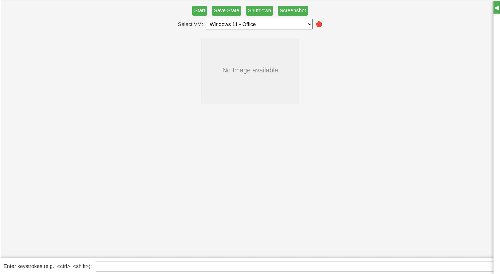

# VirtualBox Web Control Panel

A lightweight HTTP server script that offers a simple web interface for controlling and interacting with VirtualBox virtual machines.
This project uses only Python 3's standard libraries, making it easy to deploy without additional dependencies. Simply place the script on any machine that has `VBoxManage` installed, and you'll be able to manage your VMs through a web browser.

## Features

- **List VMs:** Fetch the list of available VirtualBox VMs.
- **Control Actions:** Start, shut down, or save the state of a VM using corresponding endpoints.
- **Keystroke Injection:** Convert plain text (with support for special tokens like `<enter>` or `<ctrl>`) into scancodes and send them to a selected VM.
- **Screenshot Capture:** Retrieve a live screenshot from the VM.
- **Download Screenshots:** Save the current VM screenshot as a file.
- **VM Status Indicator:** Displays whether the selected VM is running or stopped.
- **VM Details Sidebar:** Display detailed VM configuration information in a collapsible sidebar within the web interface.
- **Responsive Web Interface:** The front-end dashboard updates periodically and provides feedback for actions executed on the VM.
- **Notification System:** Displays real-time notifications for VM actions and errors.

## Demonstration

Below is a demonstration of the web interface in action:



---

## Prerequisites

- **VirtualBox:** Ensure VirtualBox is installed and the `VBoxManage` command is available on your system's PATH.
- **Python 3:** The script requires Python 3.x. It uses standard libraries such as `argparse`, `http.server`, `subprocess`, and `json`.

---

## Installation

1. Clone this repository:
   ```bash
   git clone https://github.com/nv1t/virtualbox-web-panel.git
   cd virtualbox-web-panel
   ```

2. Make the script executable:
   ```bash
   chmod +x vbox_web_control.py
   ```

3. (Optional) Create a virtual environment:
   ```bash
   python3 -m venv venv
   source venv/bin/activate
   ```

---

## Usage

Run the server:
```bash
./vbox_web_control.py --port 9091
```

Then open your browser and navigate to:
```
http://localhost:9091
```

---

## Web Interface

- **Dropdown to select VM**
- **Buttons to start/save state/shutdown a VM**
- **Textbox to send keystrokes**
- **Live screenshot preview**
- **Download screenshot button**
- **VM status indicator (🟢 for running, 🔴 for stopped)**
- **Collapsible sidebar for detailed VM information**
- **Real-time notifications for actions and errors**

You can enter plain text or special keys in angled brackets. For example:
```
<win>cmd<enter>
```

Keep in mind, that the operating system needs time to process some inputs. 

### Supported Special Keys
```
<enter> <ctrl> <shift> <alt> <tab> <backspace> <esc> <delete> <up> <down> <left> <right>
```

---

## API Endpoints

| Endpoint              | Description                            |
|----------------------|----------------------------------------|
| `/list-vms`          | Lists available VirtualBox VMs         |
| `/control-vm`        | Start/stop/save VM via query params    |
| `/send-keystrokes`   | Send scancode-based keystrokes to VM   |
| `/screenshot.png`    | Fetches latest screenshot of VM        |
| `/vm-status`         | Returns JSON VM state info             |
| `/vm-info`           | Returns detailed machine-readable information about the specified VM in JSON format. |

### API Parameter Reference

#### `/control-vm`
| Parameter | Type   | Description                          |
|-----------|--------|--------------------------------------|
| `vm`      | string | Name of the VM                       |
| `action`  | string | One of `start`, `poweroff`, `savestate` |

#### `/send-keystrokes`
| Parameter | Type   | Description                                                  |
|-----------|--------|--------------------------------------------------------------|
| `vm`      | string | Name of the VM                                               |
| `keys`    | string | Keystrokes, can include special tokens like `<ctrl>`, `<enter>` |

#### `/screenshot.png`
| Parameter | Type   | Description                                   |
|-----------|--------|-----------------------------------------------|
| `vm`      | string | Name of the VM                                |
| `download`| string | Optional. Set to `1` to download the screenshot|

#### `/vm-status`
| Parameter | Type   | Description    |
|-----------|--------|----------------|
| `vm`      | string | Name of the VM |

#### `/vm-info`
| Parameter | Type   | Description    |
|-----------|--------|----------------|
| `vm`      | string | Name of the VM |

---

## Contributing

Contributions and feedback are welcome! Feel free to fork the repository and submit pull requests to improve functionality, add features, or correct issues.

---

## Future Improvements

- Support for combo key combinations (e.g., `<ctrl>+<alt>+del`)
- Authentication layer for control access
- Configurable polling intervals for screenshots
- Command history/autocomplete in input box
- Delay Parameter and/or Ducky Script Inputs

